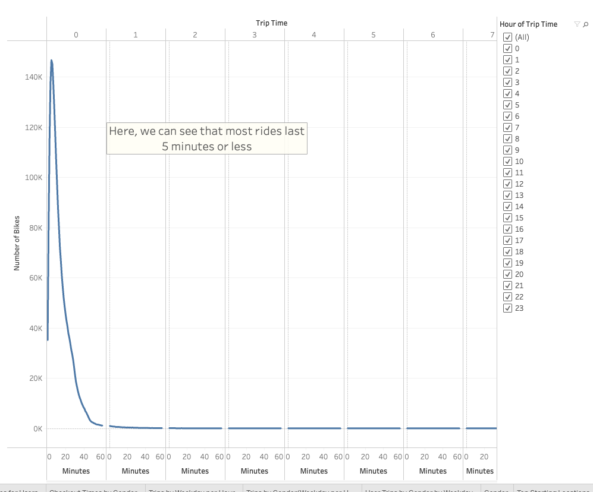
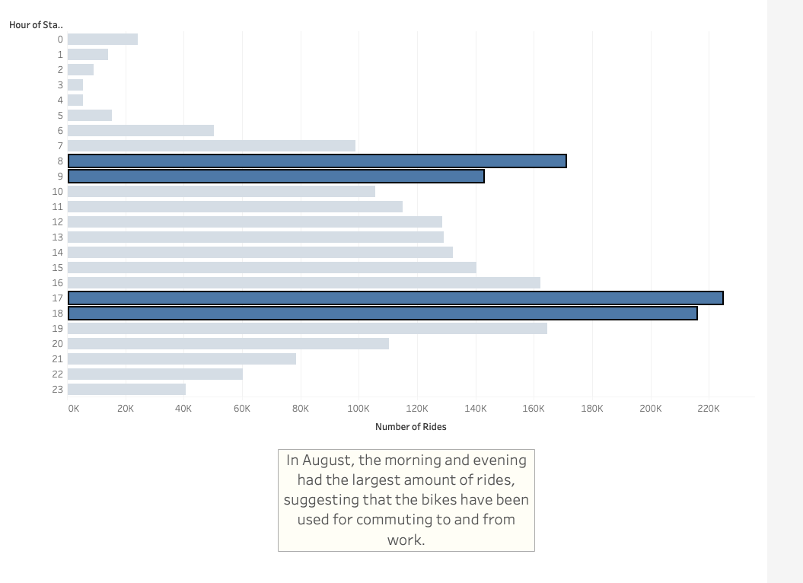
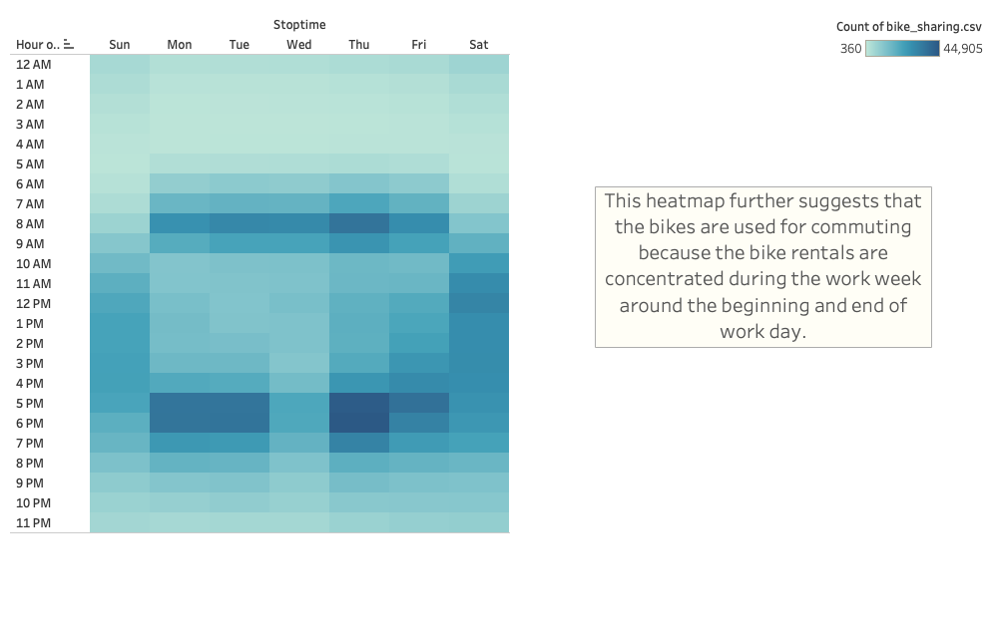
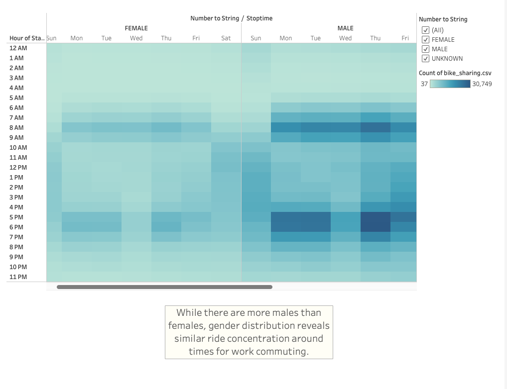
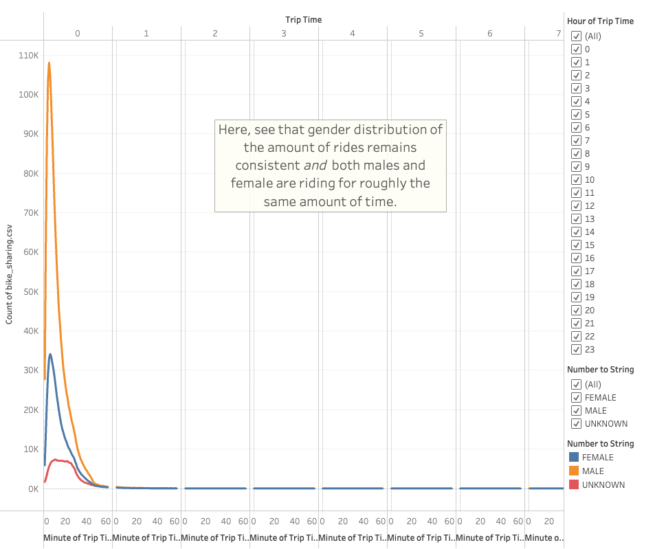
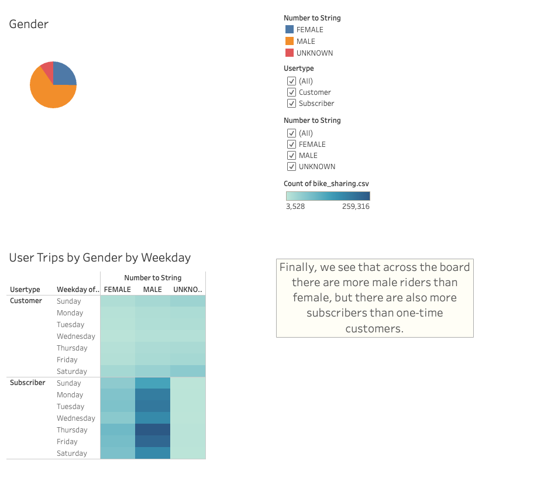

# Bike Sharing Analysis

## Overview 

- This analysis dives deeply into publically available data from Citi Bike in New York City to propose developing a similar business in De Moines, Iowa. 
- Investers would like to better understand the trips users takes when using the bikes. 
- To do so, this analysis uses a Tableau Story to analyze the following aspects of Citi Bike trips:
    1. The duration of bike trips for all genders. 
    2. The peak hours of bike use in August.
    3. Hours of bike trips per weekday among all genders.
    4. Hours of bike trips per weekday among separated by gender.
    5. Duration of bike trips separated by gender.
    6. Gender use of Citi Bike.

- To view the Tableau Story use the following link:
    - [Bike Sharing Tableau Story](https://public.tableau.com/app/profile/john.compton/viz/NYCBikeSharing_16631761573940/BikeSharingStory?publish=yes)

## Results

### All Trip Duration

- This visualization shows that most of the trips taken on the Citi Bike bicycles last 5 minutes or less.
- Short trip durations such as this imply that users are utilizing the bicycles for short distances such as commuting or tourist attractions. 

### August Peak Hours

- Here, we can see that of all hours in a 24-hour period, the hours of 8a-9a and 5p-6p see the most bicycle use among users. 
- This data, in conjunction with the short trip duration, further suggest that users are using the bicycles to commute to and from work.
- Note that the visualization shows a dip in bicycle use during work hours. 

### Trips by Weekday per Hour

- This visualization is a heatmap that shows the days of the week on the x-axis and the hours of the day on the y-axis. 
- There is a concentration of high bicycle use Monday to Friday during the hours of 8a-9a and 5p-6p. 
- Here again, it seems most users are using the Citi Bike service for commuting.

### Trips by Gender (Weekday/Hour)

- If we look at the Weekday trips per hour divided by gender, we begin to see that there are some differences between males and females in regard to Citi Bike use. 
- This heatmap visualization demonstrates that both males and females use the Citi Bike service more during the work week in the morning and evening, suggesting that the service  is used for work commuting.

### Trip Duration Separated by Gender

- Diving a bit deeper into the differences between male and female use of Citi Bike, the data suggests that both men and women primarily use the service for 5 minutes or less, with women using the bikes for about a minute longer.
- This data suggests that males and females are using the Citi Bike service for similar purposes and similar lengths of time, but there are fewer females that use Citi Bike.

### Gender Use of Citi Bike in NYC

- This final dashboard visualization confirms what the previous two suggeseted:
    - More males use Citi Bike than females
    - Males and Females use the Citi Bike service in similar ways
- Gender Breakdown of Citi Bike Use:
    - Male: 1,530,272 users
    - Female: 588,431
    - Unknown: 225,521
- This dashboard also shows that more Citi Bike users that are subscribers rather than one-time customers.
    - There are still more male subscribers than female. 

## Summary 

### High-Level Insights

- This Tableau story suggests that for a similar business to be implemented well in De Moines attention bike stations should focus around places where most people commute to and from work. 
- Also, marketing should focus on the benefits of subscribing to the service over one-time use.
- Finally, the business could benefit from marketing to particular populations such as people who identify as female.

### Suggested New Visualizations

- Adding visualizations that analyze the age of users and when they use the service could provide more clarity for potential customer base. 
- Using data from Winter and Fall months to produce visualizations that show trips by weekday could highlight the year-round sustainability of the business.
